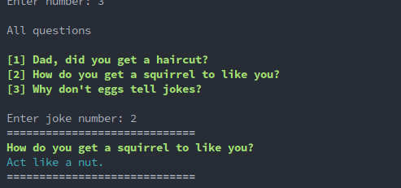

# CLI Dad joke generator built with Node.js

Console application with no purpose.

## Features

* :pushpin: Navigation menu
* :pushpin: Print full dad joke
* :pushpin: Print random dad joke
* :pushpin: Print chosen dad joke(by question)
* :pushpin: Print count of jokes in "db"
* :pushpin: Print mix - one random question/statement
* :pushpin: OOP style
* :pushpin: Can add new joke

## Installation

* Requires **Node.js**
* Requires **NPM**

```bash

    # clone repository
    git@github.com:EvaldasBurlingis/nodejs-cli-dadjoke-generator.git

    # change directory
    cd nodejs-cli-dadjoke-generator

    # install npm packages
    npm install

    # run application
    npm run start
```

## Screenshot

<div>
    
    <br/>
    <br/>
    
    <br/>
    <br/>
    
    <br/>
    <br/>
    
</div>
